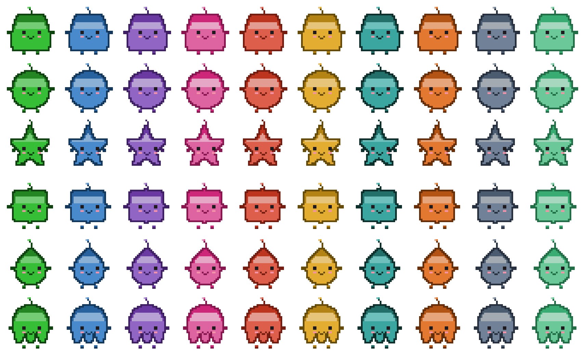

# Junimo

**A menu bar companion for your Claude account — a Stardew Valley-flavored usage dashboard for macOS.**

Junimo lives in your macOS menu bar. Click its pixel-art icon and an overlay drops down with everything you'd otherwise have to dig for: how much of your Claude usage window is left, which conversations and projects are burning tokens, which MCP servers are configured, and what plan you're on. It reads all of this from the files Claude Code already keeps on your machine, so there's nothing to log into and nothing new to set up.

<p align="center">
  
</p>

<sub>The junimo in your menu bar is yours to customize: six shapes, ten colors, and a handful of accessories.</sub>

## Features

- **Usage gauges.** Three windows at a glance — the current 5-hour block, the rolling 7-day total, and the 7-day total for the Fable/Opus model family. Each shows a percentage, a token count, and a live countdown to reset.
- **Chats.** Recent conversations, marked in-progress or done, with per-conversation token totals, the dominant model, and the project they belong to — plus a 14-day activity history.
- **Projects.** Per-project token usage over the last 7 days, last-used time, dominant model, and whether the folder is a git repository.
- **System.** Configured MCP servers with their scope (global or project) and transport (stdio, http, sse), an on-demand health check, your default model, and the installed Claude Code version.
- **Account.** Plan and tier, name and email, organization, and today's message and token counts.
- **A living junimo.** The mascot reacts to what's happening: it runs while a conversation is active, snacks when tokens are consumed, celebrates when a chat wraps up, and gets bored when things go quiet.
- **Make it yours.** A built-in editor lets you pick your junimo's shape, color, accessory, and name. Changes save automatically.
- **Built to stay out of the way.** A frameless overlay anchored under the menu bar icon, always on top, that closes as soon as you click away. No Dock icon, light and dark themes, and an optional global shortcut and launch-at-login.

## Requirements

- **macOS** (the app is menu-bar-only and uses macOS-specific window behavior).
- **[Claude Code](https://claude.com/claude-code)** installed and used at least once — Junimo reads the data it writes under `~/.claude`.
- **Node.js >= 22.18** and **Rust (stable)** to build from source.

### Privacy

Junimo reads your Claude Code data **locally and read-only**. It parses transcripts under `~/.claude/projects`, your `~/.claude.json` and `~/.claude/settings.json`, and runs `claude --version`. It never writes to any of those files, and your transcripts, project data, and account details never leave your machine.

The one network call Junimo makes on its own is to Anthropic's usage endpoint (`api.anthropic.com`), to fetch your exact usage figures — the same ones `/usage` shows. It authenticates with the Claude Code credentials already stored on your machine, which it reads strictly read-only (never refreshed, never modified, never logged). When that call isn't available, Junimo falls back to estimates computed locally from your transcripts, clearly labeled as estimates. The optional MCP health check pings the servers you've configured. There is no telemetry and no third-party service.

## Install & run

```sh
git clone https://github.com/florianfaure/junimo.git
cd junimo
npm install
npm run tauri dev
```

To produce a distributable build (an unsigned `.app` / `.dmg` under `src-tauri/target`):

```sh
npm run tauri build
```

The first Rust build takes a while as it compiles the Tauri toolchain; subsequent builds are incremental.

## Architecture

Junimo is a [Tauri v2](https://v2.tauri.app/) app: a small Rust backend behind a React webview.

- **Collector (Rust).** The heart of the app. It scans `~/.claude` defensively, parses the JSONL transcripts in a streaming pass (only files touched in the last few days), computes the sliding usage windows, reads config and MCP servers, and assembles a single `Snapshot` object. Each data source degrades independently: if one is missing or malformed, its section shows a degraded state and the rest keeps working. This layer is unit-tested with `cargo test`.
- **Frontend (React 19 + [StyleX](https://stylexjs.com/)).** A pure rendering layer — no business logic. It requests a fresh snapshot on open and on a short interval, then draws the tabs, gauges, and the junimo. The junimo itself is procedural pixel art rendered to `<canvas>` from a framework-agnostic model, so recoloring is a palette swap and the same model can render outside the browser.
- **Design system.** UI primitives come from [`@astryxdesign`](https://www.npmjs.com/org/astryxdesign), with a project theme layered on top.
- **Project governance.** The roadmap and tasks live in the repo under `docs/tasks/`, managed with [Roadmapped](https://github.com/5e1y/roadmapped). Cloning the repo and running `npx roadmapped dashboard` gives you the full project state on any machine.

## Contributing

Contributions are welcome. Please read [CONTRIBUTING.md](CONTRIBUTING.md) before opening an issue or pull request.

## License

Junimo is released under the [MIT License](LICENSE).

## Disclaimer

Junimo is an unofficial fan project, not affiliated with or endorsed by ConcernedApe LLC. Stardew Valley and Junimo are trademarks of ConcernedApe. All visual assets in this repository are original creations.
